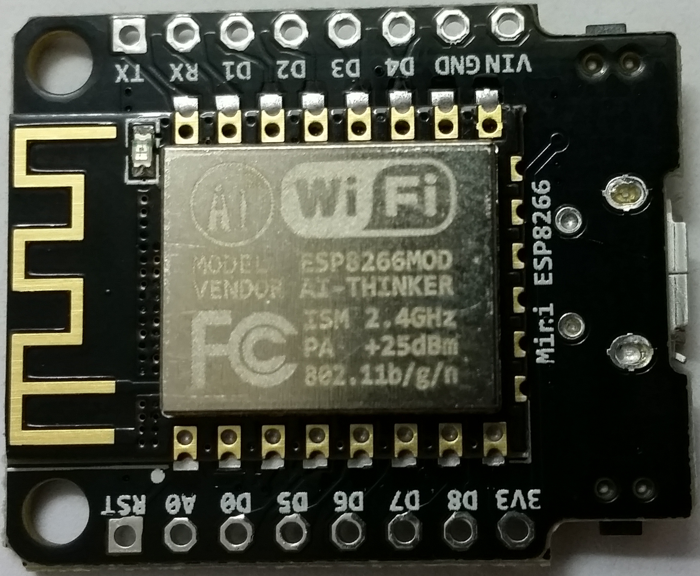
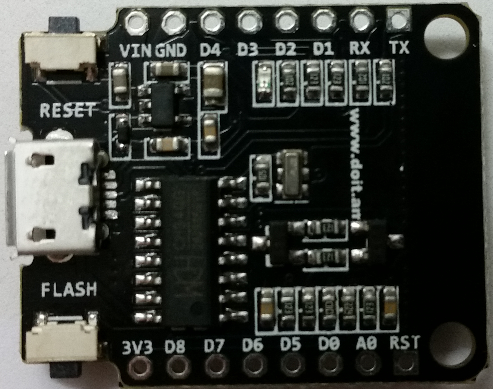
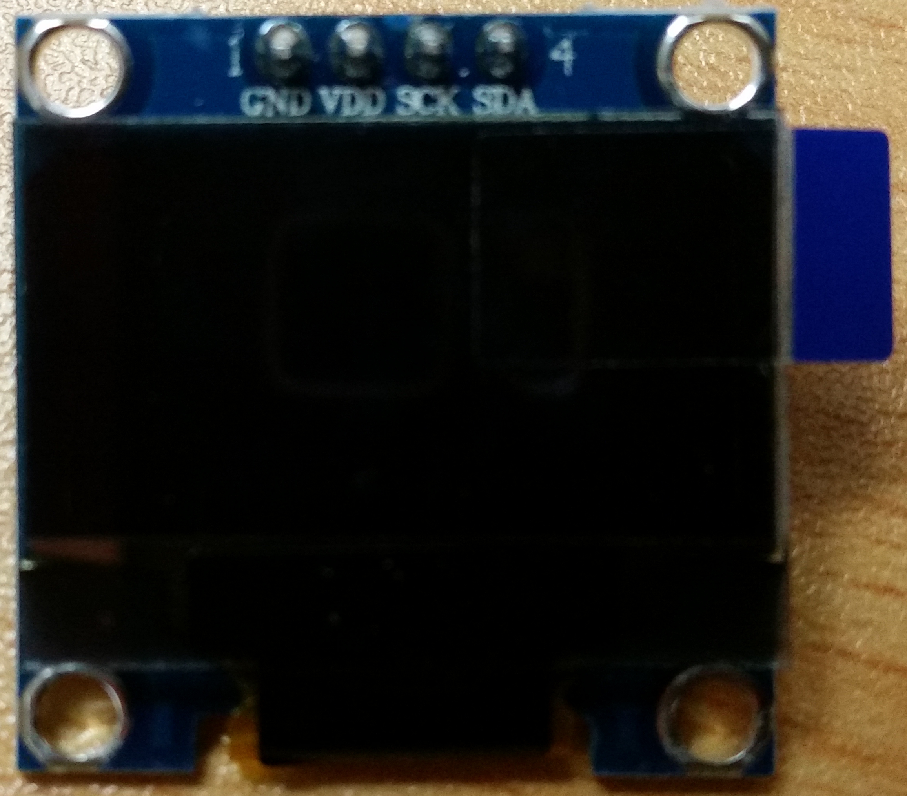
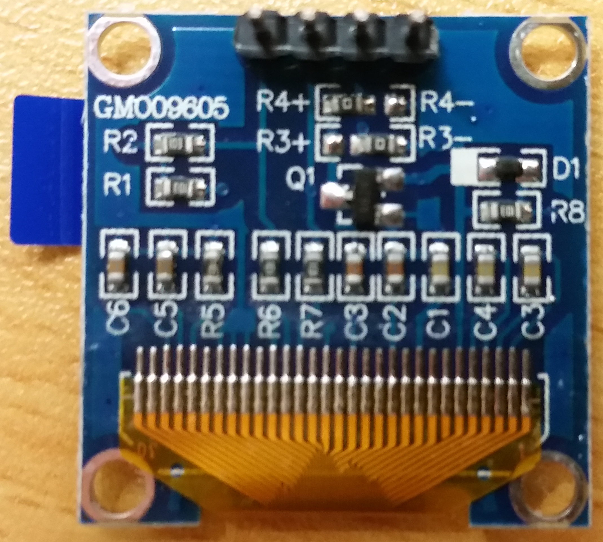
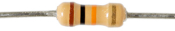

<h1>ESP8266 - 128x64 OLED Wiring</h1>

<h2>Aim</h2>
Get a 128x64 OLED I<sup>2</sup>C Module working with a clone of the WeMos D1 Mini. Reuse the Adafruit SSD1306 library to run the demo visualisation.
<h2>Parts</h2>
<ul>
 <li>WeMoS D1 Mini Clone (purchase on AliExpress marked as "Mini ESP8266")<BR>&nbsp;&nbsp;&nbsp;&nbsp;&nbsp;<i><br><br></i>
<li>OLED Module (purchase on AliExpress marked as "GM009605")
<BR>&nbsp;&nbsp;&nbsp;&nbsp;&nbsp;<br><b>Note:</b> <i>The "SCK" Pin maps to I<sup>2</sup>C "SCL"<br>
<br></i>
<li>2x 10k Ohm 5% Resistors as Pull Up<br></li>
</ul>
<h2>Fritzing Breadboard Layout</h2>

<p></p>
<h2>Important Note Regarding Pin Definitions between ESP8266 and the Arduino IDE</h2>
<p>The ESP2866 doesn't actually have any hardware I<sup>2</sup>C pins – those labeled on the Thing are the default, but you can actually use any two pins as SDA and SCL. Calling <code>Wire.begin()</code>
        will assume pins 2 and 14 are SDA and SCL, but you can manually set them to any other pin by calling
        <code>Wire.begin([SDA], [SCL])</code>.<br>
(<em>ref: Sparkfun: "<a href="https://learn.sparkfun.com/tutorials/esp8266-thing-hookup-guide/using-the-arduino-addon" target="_parent">Libraries Available/Not Available and the Differences</a>"</em>) </p>
<h2>Coding</h2>
<h3>Required Files</h3>
<ul>
  <li>Arduino IDE v1.6.10 (see the <a href="https://learn.sparkfun.com/tutorials/esp8266-thing-hookup-guide/installing-the-esp8266-arduino-addon" target="_self">Sparkfun guide</a> on how to enable ESP8266 support in the IDE)
    <ul>
      <li>Download and install the <a href="https://github.com/adafruit/Adafruit_SSD1306" target="_self">Adafruit_SSD1306</a> and <a href="https://github.com/adafruit/Adafruit-GFX-Library" target="_self">Adafruit_GFX</a> libraries</li>
      <li>Updated ssd1306_128x64_i2c example sketch (available once the Adafruit_SSD1306 library is installed and running)</li>
    </ul>
  </li>
</ul>
<h3>Manual Update/ Patching </h3>

1. Navigate to where the Adafruit_SSD1306.h (On Windows 10: C:\Users\[username]\Documents\Arduino\libraries)
2. Locate the following code and update as outlined to avoid the Arduino IDE error &quot;#error("Height incorrect, please fix Adafruit_SSD1306.h!")&quot;;
```c
//#define SSD1306_128_64
#define SSD1306_128_32
// #define SSD1306_96_16
```
to
```c
#define SSD1306_128_64
//#define SSD1306_128_32
// #define SSD1306_96_16
```
3. Save and close the Adafruit_SSD1306.h file

<H2>Arduino IDE Code</H2>
<ol>
  <li>  Within the Arduino IDE, load the ssd1306_128x64_i2c.ino example sketch from under File | Examples | Examples from Libraries | Adafruit SSD1306</li>
  <li>Update the code snippet as follows;<br><br>
  <code>#if (SSD1306_LCDHEIGHT != 64)</code><br>
  <code>#error("Height incorrect, please fix Adafruit_SSD1306.h!");</code><br>
  <code>#endif</code>
  <br>to:<br>
  <code>#define SSD1306_LCDHEIGHT 64</code><br>
  <code>#if (SSD1306_LCDHEIGHT != 64)</code><br>
  <code>#error("Height incorrect, please fix Adafruit_SSD1306.h!");</code><br>
  <code>#endif</code><br><br>
  </li>
  <li>Update the code snippet as follows;
    <br>
    <br><code>Wire.begin();</code><br>
    <code>Serial.begin(9600);</code><br>
    to:<br>
    <code>Wire.begin(D1,D3); // sda, scl</code><br>             
    <code>Serial.begin(57600);</code><br><br>
  </li>
  <li>Update the code snippet as follows;<br>
    <br>
    <code>display.begin(SSD1306_SWITCHCAPVCC, 0x3D);  // initialize with the I2C addr 0x3D (for the 128x64)</code><br>
    to:<br>
    <code>display.begin(SSD1306_SWITCHCAPVCC, 0x3C);  // initialize with the I2C addr 0x3D (for the 128x64)</code>
  </li>
</ol>